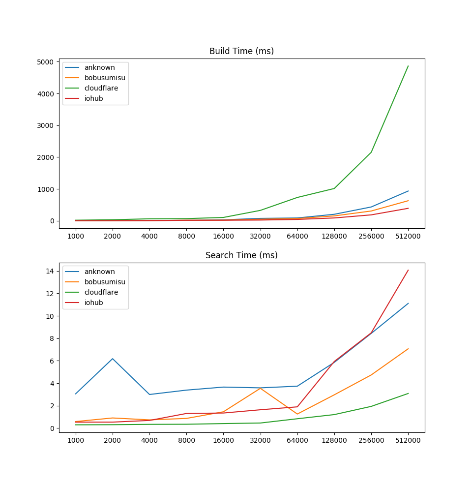

# Aho-Corasick Benchmark

Inspired by [anknown](https://github.com/anknown/ahocorasick) I wanted to see
how my [Aho-Corasick
implementation](https://github.com/BobuSumisu/aho-corasick) compared to others'.

I created a simple [benchmark](main.go) and ran it on my laptop.

With 512,000 patterns, my implementation has comparable build time and faster
search time than the other implementations:

    anknown         512000     932.57ms    10.81ms      94000
    bobusumisu      512000     631.77ms     7.20ms      94000
    cloudflare      512000    4879.41ms     2.77ms       4490
    iohub           512000     393.96ms    14.19ms      91986

[cloudflare](https://github.com/cloudflare/ahocorasick) is implemented a bit
differently though. It doesn't output position of matches but returns indices
into the original patterns array.

